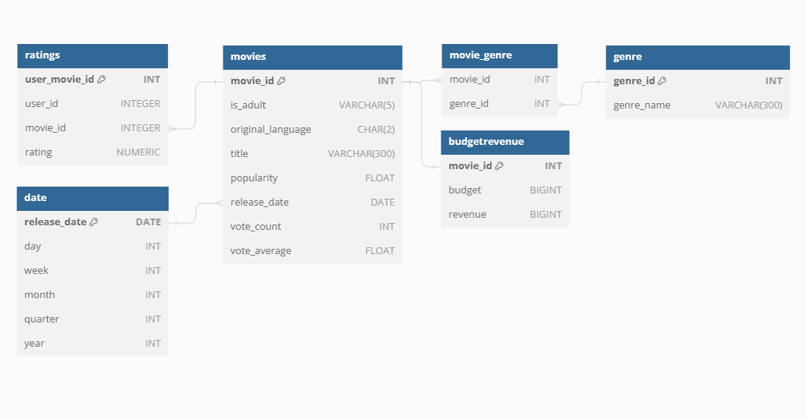

# pyspark-emr-redshift-airflow
Data Pipeline for running Pyspark in Amazon EMR and load the data to redshift data warehouse with airflow automation.

## Project Description

* The main goal of this project is to learn how to make data pipeline using pyspark in Amazon Web Services that runs in Amazon EMR with airflow automation 
* The dataset used in this project comes from Kaggle dataset https://www.kaggle.com/rounakbanik/the-movies-dataset.


## Data Pipeline

This project uses Airflow to automate pyspark script to run on EMR AWS and execute sql task to create tables and upsert the processed data into data warehouse.


1. The movie dataset is extracted from kaggle api and copied to S3.
2. Airflow will execute Create_Tables_Redshift task to create the staging tables and Data warehouse tables in Redshift.
3. Once the data already in S3, then EMR Cluster will created using Airlfow Operator `EmrCreateJobFlowOperator`.
4. Airflow will execute the add_steps so that the data in S3 will be moved into Spark cluster HDFS and data processing can begin by using the pyspark script.
5. The processed data or clean data will be moved back to s3 with parquet data format as soon as the pyspark job is done.
6. The processed data or clean data will be loaded into redshift data warehouse as well (staging table -> data warehouse table).


## Data Model

* The data model for this project is as shown below:  



## Development

* Build the Docker / Pull docker image
```bash
    # Build the docker 
    docker build . -tag {IMAGE_NAME} . 
```
* Replace the webserver image in docker-compose.yaml to the image name of the Docker image you have built
```yaml
    version: '3.8'
    x-airflow-common:
    &airflow-common
    # In order to add custom dependencies or upgrade provider packages you can use your extended image.
    # Comment the image line, place your Dockerfile in the directory where you placed the docker-compose.yaml
    # and uncomment the "build" line below, Then run `docker-compose build` to build the images.
    image: ${AIRFLOW_IMAGE_NAME:-extend-airflow:latest}
    # build: .
```

